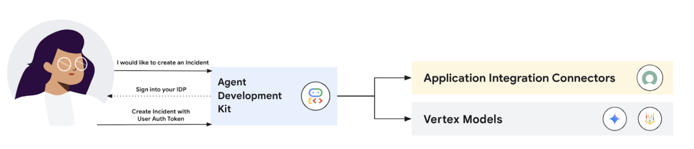

# Incident Management Agent using Integration Connector

## Overview

This agent sample showcases the utilization of dynamic identity propagation with ServiceNow and [Application Integration Connectors](https://cloud.google.com/application-integration/docs/using-integration-connectors), allowing your end user credentials to be passed at runtime to an underlying connection action (in this case, ServiceNow Incidents). This framework removes the previous requirement of hardcoded service account credentials, as your end users token/identity is now validated on a per request basis (typically recommended from a security perspective)

### Agent Architecture



## Setup and Installation

### Prerequisites

- Google Cloud Project with the following roles assigned
  - Application Integrations Admin
  - Connectors Admin
  - Secret Manager Admin
  - Storage Admin
  - Service Usage Consumer
  - Logs Viewer
- Setup [Application Integration](https://cloud.google.com/application-integration/docs/setup-application-integration) and [Integration Connectors](https://cloud.google.com/integration-connectors/docs/setup-integration-connectors)

Once you have created your project, [install the Google Cloud SDK](https://cloud.google.com/sdk/docs/install). Then run the following command to authenticate:
```bash
gcloud auth login
```
You also need to enable certain APIs. Run the following command to enable:
```bash
gcloud services enable aiplatform.googleapis.com
```

### ServiceNow Account Setup

*Note: This is assuming the end user does not already have access to a ServiceNow instance. If you already have access to a trial/paid organization (with elevated credentials to create Incidents), you can skip this step*

1. Create a ServiceNow Personal Developer Instance/trial account as noted [here](https://developer.servicenow.com/dev.do#!/learn/learning-plans/washingtondc/new_to_servicenow/app_store_learnv2_buildmyfirstapp_washingtondc_exercise_obtain_a_personal_developer_instance). Once your instance is created and available, take note of the Instance ID (https://*instanceid*.service-now.com). You can alternatively retrieve this information by selecting your profile and navigating to the “Start Building” blade (which will pop out to your instance set).
2. [Creating a user id/assigning pertinent permissions](https://www.servicenow.com/docs/bundle/zurich-platform-administration/page/administer/users-and-groups/task/t_CreateAUser.html)
   1. Follow the noted instructions to create a user for your dynamic identity propagation - for this example I filled in the following:
      1. User ID - take a note of this value as it is needed for later
      2. First Name
      3. Last Name
      4. Email
      5. Ensure the user is “Active”
   2. Navigate back to the user created and do the following:
      1. [Set a user password](https://www.servicenow.com/docs/bundle/yokohama-platform-security/page/integrate/authentication/task/reset-your-password.html) - copy the password, this will be needed later
      2. [Assign a role to the user](https://www.servicenow.com/docs/bundle/yokohama-platform-administration/page/administer/users-and-groups/task/t_AssignARoleToAUser.html) - this role assignment will vary depending on the use case, but given our reference sample we will be assigning “Admin” permissions (more on assigning minimal viable permissions, where required, can be seen [here](https://www.servicenow.com/docs/bundle/zurich-platform-administration/page/administer/roles/reference/r_BaseSystemRoles.html))
   3. [Create OAuth Application](https://www.servicenow.com/docs/bundle/xanadu-security-management/page/product/secops-integration-sir/secops-integration-splunk-addon/task/configure-application-registry-splunk.html) which will be utilized as a part of our 3-legged OAuth workflow
      1. Take note of the client id and secret, this will be needed later

### Integration Connector Setup

1. Clone the repo by running the following command
```
git clone https://github.com/GoogleCloudPlatform/application-integration-samples.git
```
2. Navigate to the 'adk-incident-management' directory in your terminal
```
cd application-integration-samples/src/adk-incident-management
```
3. Update the `env.sh` file with the approriate values and run `source env.sh`
4. Run the following command - `./create-connector.sh`

NOTE: This will take a few minutes to provision

5. Once the connector is provisioned, login to GCP console, navigate to Integration Connectors and then click on the “Authorize Connection” blade in your connection details, which will open up a pop up. In that pop up, copy the redirect URL provided (something along the lines of https://console.cloud.google.com/connectors/oauth) and paste it into the Redirect URL settings available to your previously registered ServiceNow application (`Application Registry -> Select pertinent application -> Redirect URL -> Update`)
6. Once the Redirect URL is copy/pasted, click Authorize - which will ask for consent for your Admin credentials to authorize the underlying application set. Please make sure you are consenting on behalf of your Admin (ie: registration credentials), and if needed perform this grant/consent in an incognito window
7. At this point in time, your connection should be considered in an `Active` state

### Application Integration Process Set Up

1. Update the `env.sh` file with the approriate values and run `source env.sh`
2. Run the following script - `./create-integration.sh`
3. Once this is complete, navigate to `Application Integration` in GCP console to find the `ExecuteConnection` integration created and published