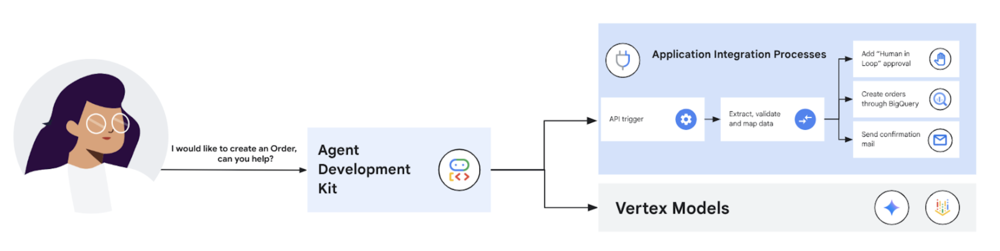

# Incident Management Agent using Integration Connector

## Overview

This agent sample showcases the art of the possible using the [ADK](https://google.github.io/adk-docs) and [Application Integration](https://cloud.google.com/application-integration/docs/overview), Google Cloud’s low-to-no code integration platform for building Agentic workflows. Application Integration will be used in this sample to orchestrate a deterministic set of operations, including the following:
- Order processing/storage via BigQuery
- Orchestrating email confirmations once the order data has been written to BigQuery
- Invoking a “Human in the Loop” approval pattern if the order quantity exceeds 100


### Agent Architecture



## Setup and Installation

### Prerequisites

- Google Cloud Project with the following roles assigned
  - Application Integrations Admin
  - Connectors Admin
  - Secret Manager Admin
  - Storage Admin
  - Service Usage Consumer
  - Logs Viewer
  - BigQuery Admin
- Setup [Application Integration](https://cloud.google.com/application-integration/docs/setup-application-integration) and [Integration Connectors](https://cloud.google.com/integration-connectors/docs/setup-integration-connectors)

Once you have created your project, [install the Google Cloud SDK](https://cloud.google.com/sdk/docs/install). Then run the following command to authenticate:
```bash
gcloud auth login
```

You also need to enable certain APIs. Run the following command to enable:
```bash
export PROJECT_ID=<set-project-id>
gcloud services enable bigquery.googleapis.com --project "$PROJECT_ID"
```

### Application Integration Setup

1. Clone the repo by running the following command
```
git clone https://github.com/GoogleCloudPlatform/application-integration-samples.git
```
2. Navigate to the 'adk-order-processing' directory in your terminal
```
cd application-integration-samples/src/adk-order-processing
```
3. Update the `env.sh` file with the approriate values and run `source env.sh`
4. Run the following command (NOTE: This will take a few minutes to provision)
```
./deploy-integration.sh
```
5. Once the script has completed running, you can login to the GCP console and navigate to `Integration Connectors` to find a connnector called `bq-orders`
6. Similarly, navigate to Application Integration and find `sample_order_processing` created and published