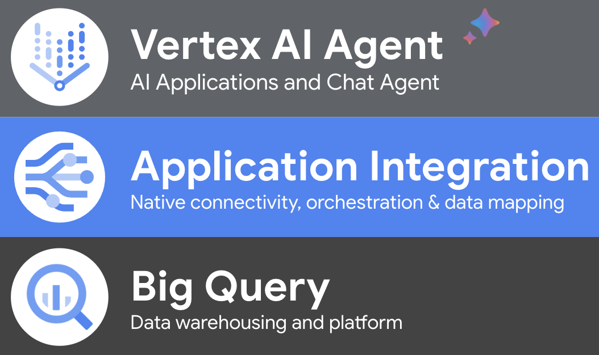

# Using Application Integration & Vertex Agents to activate BigQuery Data

### Summary
This repository contains all necessary resources to implement a demo that enables a Vertex Agent to respond questions about data that is stored in bigquery. Data is being extracted via application integration native connectors.

> [!IMPORTANT]
> The full demo instructions and configurations for this demo can be found in the following link: [Using Application Integration & Vertex Agents to activate BigQuery Data](https://www.googlecloudcommunity.com/gc/Integration-Services/Using-Application-Integration-amp-Vertex-Agents-to-activate/m-p/783599)


#### Let's have a chat with BigQuery. 

In this technical demonstration, we will explore the functionalities of the native connectivity features of Application Integration. We will demonstrate how we can utilize BigQuery data to enhance AI applications and empower users in their daily tasks.

The demonstration will cover the following:



* **Vertex AI Agent:** Configuring an agent that uses an OpenAPI Specification to access data and responds to questions about the information stored in BigQuery.
* **Application Integration:** Native connectivity. Configuring a simple way of integrating with the data platform and restructuring data to accommodate it for its consumption.
* **BigQuery:** A dataset will be configured to act as sample data. Bigquery will act as a data warehouse where valuable business data rests.

### Dependencies
The following dependencies are required for the demo:

| File     | Description |
|:----------:|:-------------|
| users-export.csv    | Sample data for bigquery table. |
| big-query-integration.json    | The integration flow responsible for native connectivity to BigQuery (and 100+ other platforms and apps 🤩)      |
| user_management_api.yaml    | OpenAPI Specification file of the integration.      |
| user-management-agent-app.zip    | An Vertex AI Agent application, bundled and ready to be tested. |

### Pre-Requisites
In order to configure APIs, Permissions and Service Accounts, open a **Cloud Shell** and Copy/Paste the following commands:

> [!NOTE]
> Make sure you populate these environment variables with the information required.

```shell
PROJECT_NUMBER="{your project number}"
PROJECT_ID="{your project number}"
EMAIL="{your user email}" #The email/principal configuring the demo.
SERVICE_ACCOUNT_NAME="big-query-data-editor"
SERVICE_ACCOUNT=$SERVICE_ACCOUNT_NAME@$PROJECT_ID.iam.gserviceaccount.com
```

Set the project context:
```shell
gcloud config set project $PROJECT_ID
```

Enable the APIs:
```shell
#Enable APIs
gcloud services enable integrations.googleapis.com \
    secretmanager.googleapis.com \
    connectors.googleapis.com \
    bigquery.googleapis.com \
    bigquery.googleapis.com --project=$PROJECT_ID
```
Add the following role to your user email:
```shell
#Add role to user
gcloud projects add-iam-policy-binding $PROJECT_ID \
    --member=user:$EMAIL \
    --role='roles/connectors.admin'
```
Create a service account for Application Integration. This will enable access to Big Query:
```shell
#Create service account
gcloud iam service-accounts create $SERVICE_ACCOUNT_NAME \
    --display-name=$SERVICE_ACCOUNT_NAME
```

Add Roles to app integration service account:
```shell
#Add roles to service account
gcloud projects add-iam-policy-binding $PROJECT_ID \
    --member=serviceAccount:$SERVICE_ACCOUNT \
    --role='roles/bigquery.dataEditor'

gcloud projects add-iam-policy-binding $PROJECT_ID \
    --member=serviceAccount:$SERVICE_ACCOUNT \
    --role='roles/bigquery.jobUser'

gcloud projects add-iam-policy-binding $PROJECT_ID \
    --member=serviceAccount:$SERVICE_ACCOUNT \
    --role='roles/bigquery.readSessionUser'
```
Create DialogFlow service identity and Add role to DialogFlow Service Agent:
```shell
gcloud beta services identity create --service=dialogflow.googleapis.com \
  --project=$PROJECT_ID

gcloud projects add-iam-policy-binding $PROJECT_ID \
    --member=serviceAccount:service-$PROJECT_NUMBER@gcp-sa-dialogflow.iam.gserviceaccount.com \
    --role='roles/integrations.integrationInvoker'
```

